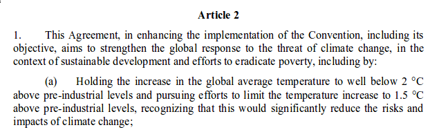
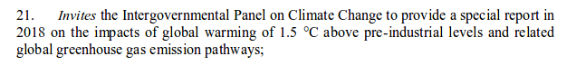
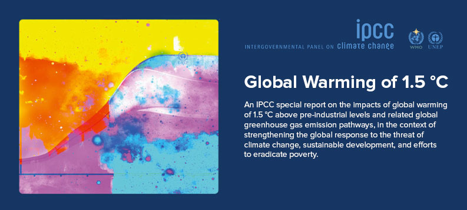
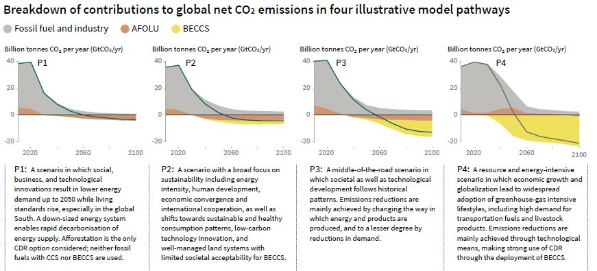
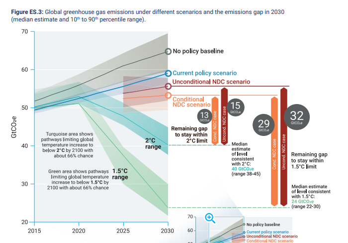
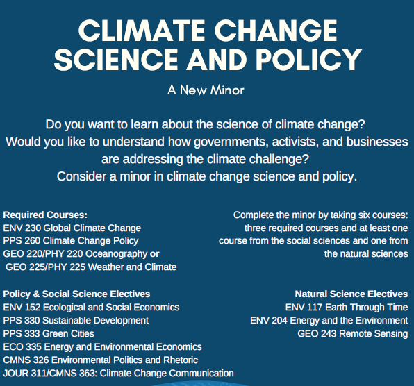

```{r setup, include=FALSE}
knitr::opts_chunk$set(echo = FALSE)
```

## Paris Agreement, 12 December 2015 {.build}

<div class="centered">

<br>
<br>
</div>

<div class="centered">

</div>

## Implementation Under Paris

>- Entered into force, 4 Nov. 2016 (4 Nov. 2020 is the earliest date a country can withdraw)

>- Legally binding elements are largely procedural

>- Nationally Determined Contributions (Submitted every 5 years, 2020, 2025, 2030)

>- Global stocktaking beginning in 2023 (continuing every 5 years). How is implementation going?

>- 2017 GHG emissions were around 49-53 GtCO<sub>2</sub>e

>- Just to have a good chance to meet _2?_, global emissions have to peak by 2020

## Global Warming of 1.5?, Oct. 2018

<div class="centered">

</div>

## Key Takeaways

- Earth's carbon budget is quickly shrinking (at current levels we have about 10 years)
- When compared to a 2? scenario levels of risk are elevated for key areas of concern
- Speedy action on a large scale for transforming energy supply is needed
- Policy makers need to be mindful of synergies and trade-offs as they relate to Sustainable Development Goals
- Any effort to limit temperatures to 1.5? will require carbon removals
- Extent of carbon removals depends on various assumptions surrounding policy, emissions trends, and the degree to which overshoot will be accommodated.

## Pathways

<div class="centered">

</div>

## Emissions Gap

<div class="centered">

</div>

## Problems with relying on AFOLU & BECCS 

>- AFOLU (Agriculture, Forestry & Other Land Use) 
>- BECCS (Bioenergy WITH Carbon Capture & Storage)
>- Competing land use demands
>- Significant land requirements for BECCS
>- Are supply chain emissions associated with BECCS taken into account?
>- Could higher levels of demand for biomass impact indirect emissions from product displacement (i.e. demand for concrete or metals)
>- Concerns about safe storage of CO<sub>2</sub>
>- Potential negative impacts on biodiversity
>- Water stress as irrigation demands increase
>- Barrier to low-carbon energy transition

--- 

<div class="centered">

</div>